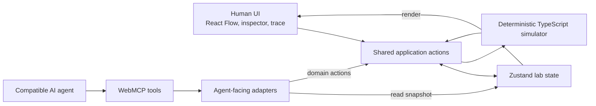

# NetLab

NetLab is a browser-based, agent-native IPv4 network lab where people and compatible AI agents inspect, troubleshoot, and modify the same deterministic simulation state.

[**Live Demo**](https://web-mcp-challenge.vercel.app/) · [**Demo Video**](https://youtu.be/VaqwLiFAb6g)


## What is NetLab?

Network simulators let people experiment with addressing and routing without physical hardware. Troubleshooting usually means reading a topology, checking interface addresses and gateways, following route-table decisions, and testing both directions of a connection.

NetLab provides that workflow as a focused, client-side Layer 3 lab. A human can build a topology of PCs and routers, connect devices, configure IPv4 interfaces and static routes, load working or broken examples, and inspect hop-by-hop connectivity results.

The project also asks a more specific question: what changes when an AI agent can participate directly in the same live simulator? Through WebMCP, NetLab exposes structured topology, device state, deterministic diagnostics, visual guidance, and narrowly scoped route actions to compatible agents.

NetLab is not a full network emulator or a replacement for Cisco Packet Tracer. It is a compact environment for learning and reasoning about IPv4 forwarding and static routing.

## Why WebMCP?

Without application-level tools, an agent must reconstruct the lab from presentation details. With WebMCP, it can work with NetLab's domain model directly.

| Traditional browser automation | NetLab with WebMCP |
| --- | --- |
| Interprets screenshots or DOM structure | Receives structured devices, links, interfaces, and routes |
| Locates controls and reads fields individually | Calls explicit, documented network-lab tools |
| Infers whether a visual result means success | Invokes NetLab's deterministic simulator |
| Manipulates generic UI elements | Performs validated domain actions through the same application logic as the UI |

The result is a shared workspace, not a separate agent-side model of the network:

> Human sees failed connectivity → agent reads the topology → NetLab simulates the path → agent inspects and highlights the failing router → agent applies a requested route change → NetLab verifies the repair

The model can reason about the returned evidence, but it does not decide whether a packet is deliverable. **ChatGPT reasons about the result; NetLab decides whether the network works.**


## Demo

[Watch the complete demo on YouTube](https://youtu.be/VaqwLiFAb6g).

The main scenario uses the included **Broken Static Routing Challenge**:

1. Load **Broken lab**.
2. Ask ChatGPT:

   > PC-01 can't reach PC-02. Use NetLab's site tools to diagnose exactly what's wrong. Don't change anything yet.

3. Ask:

   > Highlight the device I should inspect.

4. Ask:

   > Fix the routing issue and test the connection again.

NetLab reports that the forward path reaches PC-02 but the return path stops at Router-02 with `NO_ROUTE`. The missing route is `192.168.1.0/24` via `10.0.0.1`. After the requested route is added, the simulator runs again and confirms reachability in both directions.


## WebMCP tools

NetLab intentionally exposes a small set of domain-specific capabilities instead of mirroring every button in the interface.

| Tool | Purpose | Effect |
| --- | --- | --- |
| `get_topology` | Read all current devices and physical links. | Read-only; returns stable device, interface, and link IDs. |
| `get_device_state` | Read the live configuration of one PC or router. | Read-only; returns interfaces, peers, validation issues, gateways, or static routes as applicable. |
| `test_connectivity` | Run NetLab's deterministic bidirectional connectivity simulation. | Updates the packet-trace and reachability UI; does not change network configuration. |
| `highlight_device` | Direct the human to a specific device. | Selects the device on the canvas and opens its inspector; configuration is unchanged. |
| `add_static_route` | Add a validated route to an existing router. | Uses the same route action as the inspector and selects the affected router. |
| `remove_static_route` | Remove an existing router route by route ID or destination/next-hop pair. | Uses the shared removal action and selects the affected router. |

The write tools do not expose device creation, deletion, linking, interface configuration, gateway changes, or preset loading.

## How WebMCP is implemented

`WebMcpBridge` registers the tools when the client application mounts. This is a real excerpt from [`lib/webmcp/registerTools.ts`](lib/webmcp/registerTools.ts):

```ts
await modelContext.registerTool(
  {
    name: 'get_topology',
    title: 'Get topology',
    description:
      'Inspect the current NetLab topology. Returns every device and physical connection in the live network lab. Use this first when you need to understand which devices exist and how they are connected.',
    inputSchema: emptyInput,
    annotations: { readOnlyHint: true },
    execute: async () => {
      log('executing get_topology')
      return getTopology(labApi.getState())
    },
  },
  options,
)
```

The other handlers follow the same pattern:

```text
WebMCP tool → agent-facing adapter → labApi/application action → shared state → simulator and UI
```

- Read tools serialize the current `labApi` snapshot rather than reading rendered UI.
- `test_connectivity` calls the existing `runPing` action and returns the simulator's structured result.
- Route tools validate input, then reuse the same `addStaticRoute` and `removeStaticRoute` actions used by the inspector.
- `highlight_device` reuses the shared device-selection action.
- Tool registrations are tied to an `AbortController`, so the client bridge can cleanly unregister them.

There is no parallel agent-only copy of the topology. A route added in the inspector is visible to the next tool call, and a route added through WebMCP appears immediately in the inspector.

## Network simulation engine

The simulator is pure TypeScript and runs entirely in the browser. Given the same topology and configuration, it returns the same result.

Implemented behavior includes:

- strict IPv4 parsing and CIDR-prefix validation
- subnet and network-address calculations
- directly connected network selection
- PC default-gateway validation and resolution
- router static routes with longest-prefix matching
- next-hop resolution through a connected interface and neighbor
- hop-by-hop forward-path tracing
- independent return-path validation for ping
- routing-loop detection and a 16-hop limit
- structured failures such as `NO_DEFAULT_GATEWAY`, `INVALID_GATEWAY`, `NO_ROUTE`, `NEXT_HOP_UNREACHABLE`, `INTERFACE_UNCONFIGURED`, `DESTINATION_UNREACHABLE`, `ROUTING_LOOP`, and `INVALID_CONFIGURATION`

For a PC, the engine first checks whether the destination is local; otherwise it resolves the configured default gateway. For a router, it checks directly connected networks before choosing the best matching static route. A connectivity test succeeds only when both the forward and return traces succeed.

This is logical Layer 3 simulation. It does not claim packet-level timing, operating-system behavior, or protocol fidelity beyond the features listed above.

## Architecture



React Flow nodes and edges are derived from the domain state; they are not a second copy of the network. The simulator is kept separate from rendering, which makes its routing behavior directly testable under Vitest.

## Tech stack

- Next.js 16 and React 19
- TypeScript
- React Flow (`@xyflow/react`)
- Zustand
- Tailwind CSS 4
- WebMCP Imperative API with `@mcp-b/webmcp-types`
- Vitest
- Vercel Analytics and Vercel deployment

No backend is required for the lab or simulator.

## Run locally

The repository includes a pnpm lockfile and workspace configuration.

```bash
git clone https://github.com/RealPratham21/WebMCP-Challenge.git
cd WebMCP-Challenge
pnpm install
pnpm dev
```

Open [http://localhost:3000](http://localhost:3000).

Run the test suite:

```bash
pnpm test
```

Create and serve a production build:

```bash
pnpm build
pnpm start
```

## Testing WebMCP

### ChatGPT

1. Open the [deployed NetLab site](https://web-mcp-challenge.vercel.app/) in ChatGPT's WebMCP-capable in-app browser.
2. Open **Site tools** and confirm that NetLab exposes six tools.
3. Ask ChatGPT to inspect or diagnose the live lab using those tools.

The demo prompts above provide a complete read → diagnose → highlight → repair → verify workflow.

### Chrome

1. Open `chrome://flags/#enable-webmcp-testing` in a WebMCP-capable Chrome build.
2. Enable the flag and relaunch Chrome.
3. Start NetLab with `pnpm dev` and open [http://localhost:3000](http://localhost:3000).
4. In DevTools, list the registered tools:

```js
const tools = await document.modelContext.getTools()
tools.map((tool) => tool.name)
```

Expected set (order may vary):

```js
[
  'add_static_route',
  'get_device_state',
  'get_topology',
  'highlight_device',
  'remove_static_route',
  'test_connectivity',
]
```

Invoke the topology tool directly:

```js
const topology = tools.find((tool) => tool.name === 'get_topology')
await document.modelContext.executeTool(topology, '{}')
```

When `document.modelContext` is unavailable, NetLab continues to work as a normal browser-based simulator; it simply does not register agent tools.

## Current scope

### Supported

- PCs and routers
- point-to-point physical links, with one interface at each endpoint
- one `eth0` interface per PC with at most one link, plus dynamically allocated router interfaces
- IPv4 addresses and CIDR prefixes
- PC default gateways
- directly connected router networks
- static routes and longest-prefix selection
- deterministic forward and return path checks
- hop-by-hop traces and structured routing failures
- working and broken static-routing presets
- live human edits plus the six WebMCP capabilities documented above

### Not currently simulated

- Ethernet switching, ARP, VLANs, or switches
- DHCP, DNS, NAT, or firewalls
- dynamic routing protocols such as OSPF, BGP, or EIGRP
- IPv6
- Cisco IOS or vendor-specific device behavior
- real packet I/O, sockets, virtual machines, containers, latency, or bandwidth

NetLab is currently browser-local and single-user. It has no persistence or backend, packet visualization is hop-based rather than animated, and the **Save** and **Export** toolbar buttons are presentational placeholders.

## Project structure

```text
app/                         Next.js application shell and global styles
components/                  Canvas, device inspector, trace UI, WebMCP bridge
lib/lab-store.ts             Shared Zustand store and labApi wrappers
lib/lab/                     Pure application actions, validation, React Flow mapping
lib/simulator/               IPv4 utilities, topology helpers, engine, presets, tests
lib/webmcp/                  Registration, adapters, serializers, result types, tests
screenshots/                 Submission and workflow images
```

## Tests

The Vitest suite covers IPv4/CIDR utilities, lab actions, simulator behavior, and the WebMCP adapters. Cases include same-subnet delivery, default-gateway handling, static routing across two routers, longest-prefix matching, missing forward and return routes, unreachable next hops, malformed configuration, disconnected topology, routing loops, the hop limit, live-state serialization, validated route mutations, device highlighting, and repair/rebreak workflows.

## License

This repository does not currently include an open-source license file.
